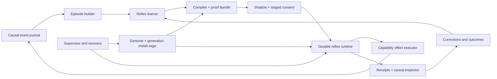

# ourro — Chosen Direction and Technical Plan: The Reflex Operating System

*Decision and research cutoff: 2026-07-18. Repository observations describe a
moving working tree based on commit `bde23ae` plus the uncommitted daily-driver
and reflex arcs. This document chooses among
[the seven reviewed directions](technical-review-next-steps.md) and extends,
rather than replaces, [the M13–M16 reflex plan](plan-reflexes.md). Re-check
source anchors and implementation status before execution.*

## Executive decision

Choose **Direction 2: a reflex operating system**.

The product should be positioned more precisely as a **local-control personal
reflex compiler for software work**:

> ourro notices the engineering loops a developer repeats through its tools
> and jobs, turns them into tested executable behavior, asks once before
> activation, and provides a causal receipt and an exact version-rollback target
> every time the behavior runs.

This is one primary route, not seven parallel bets:

- **Direction 4, the proactive engineering intern, is the first experience.** A
  failed job should already have a read-only diagnosis waiting.
- **Direction 1, proof-carrying evolution, is the safety substrate.** No reflex
  is trustworthy without isolated verification and a crash-consistent install
  saga.
- **Direction 5, counterfactual trust, is the promotion policy.** Shadow results,
  outcomes, corrections, and confidence determine whether a reflex advances.
- Workspace memory, causal time travel, and eventually portability support the
  reflex product; they are not separate near-term product centers.

The choice is conditional. Generic triggers, scheduled agents, memory, and
background coding are already crowded categories. ourro only has a durable
advantage if it owns the complete loop:

**observed behavior → conservative generalization → verified Lisp reflex → one
blessing → durable execution → measured outcome → correction or exact version
rollback**.

## Evidence standard and limitations

The decision combines four kinds of evidence:

1. the intended architecture in [the reflex plan](plan-reflexes.md) and
   [the original product plan](greenfield-lisp-self-evolving-agent.md);
2. actual repository paths, including the in-flight automation, reaction-mining,
   staged-candidate, and investigation implementations;
3. current product and developer research from primary or first-party sources;
4. a weighted comparison of the seven routes.

The external evidence shows demand, competition, and design constraints. It does
**not** prove product-market fit. Vendor metrics are self-reported, no ourro
usage telemetry was available for this review, and no customer interviews were
conducted. User segments, scores, and metric thresholds below are testable
product hypotheses rather than market facts.

## Why this route wins

### Decision criteria

Scores use a 1–5 scale. The weighted total is a decision aid, not a claim of
measurement precision. A high operating-burden score means the route is easier
to run reliably. Repository leverage and Lisp advantage together receive only
10% of the balanced score so the rubric does not simply reward ideas shaped like
the existing implementation.

| Criterion | Weight | Question |
|---|---:|---|
| User pain and frequency | 20% | Does the route remove recurring, expensive work? |
| Buyer value | 10% | Is there a plausible payer with a valuable outcome, not merely an interested user? |
| Adoption and distribution | 10% | Can the target user discover, install, trust, and keep it running? |
| Market white space | 15% | Is there a meaningful gap beyond current agents, hooks, and memory products? |
| Architectural defensibility | 15% | Is the complete capability difficult to reproduce as a shallow feature? |
| Operating burden | 10% | Can a small team make it reliable without becoming a cloud workflow operator? |
| Repository leverage | 5% | Does the current architecture materially shorten the path to a convincing proof? |
| Net Lisp advantage | 5% | Do Lisp semantics add more product value than packaging, hiring, portability, and containment costs remove? |
| Speed to validated value | 5% | Can real users experience and judge the benefit soon? |
| Strategic option value | 5% | Does it create useful follow-on products if it succeeds? |

### Weighted scorecard

| Direction | Pain | Buyer | Adopt | White | Defend | Operate | Repo | Lisp | Speed | Options | / 100 |
|---|---:|---:|---:|---:|---:|---:|---:|---:|---:|---:|---:|
| 1. Proof-carrying evolution | 3 | 3 | 3 | 5 | 5 | 3 | 4 | 4 | 2 | 4 | **74** |
| 2. Reflex operating system | 5 | 4 | 2 | 3 | 4 | 2 | 5 | 5 | 4 | 5 | **76** |
| 3. Workspace digital twin | 4 | 3 | 2 | 2 | 3 | 2 | 3 | 3 | 3 | 4 | **58** |
| 4. Proactive engineering intern | 5 | 4 | 4 | 1 | 2 | 4 | 4 | 2 | 5 | 4 | **68** |
| 5. Counterfactual trust/evolution economy | 4 | 3 | 2 | 5 | 5 | 2 | 3 | 4 | 2 | 5 | **74** |
| 6. Time-travel laboratory | 3 | 3 | 2 | 4 | 4 | 2 | 3 | 5 | 2 | 4 | **64** |
| 7. Signed gene ecology | 2 | 3 | 1 | 2 | 3 | 1 | 3 | 4 | 1 | 5 | **46** |

The result is a **narrow**, conditional win, not a mandate manufactured by the
rubric. A sensitivity check changes the build emphasis:

| Lens | Highest scores | Consequence |
|---|---|---|
| Balanced product (weights above) | Reflex OS 76; proof 74; trust 74 | Choose Reflex OS, but treat proof and trust as inseparable. |
| Go-to-market-heavy (pain, buyer, adoption, speed = 75%) | Proactive intern 77; Reflex OS 73 | Use the read-only intern as the acquisition and first-value surface. |
| Lisp-thesis-heavy (net Lisp advantage = 25%) | Reflex OS 85; proof 77; trust 77; time travel 73 | Reflex OS best integrates the language ideas; time travel remains a debugger, not the product. |
| Foundation-first (prerequisite leverage, safety, simplicity) | Proof 88; trust 72; Reflex OS 68 | The next engineering gate is proof-carrying evolution even though the destination is Reflex OS. |

The go-to-market lens weights pain 25%, buyer value 20%, adoption 20%, white
space 10%, defensibility 10%, operating burden 5%, and speed 10%. The Lisp lens
weights net Lisp advantage 25%, pain and defensibility 15% each, white space and
repository leverage 10% each, and the other criteria 5% each. The
foundation-first lens answers a different question—what reduces the risk of all
later work—using prerequisite leverage 40% and defensibility, repository
leverage, and operating simplicity at 20% each. Publishing all three prevents
the product score from being misread as implementation order. Its prerequisite
scores are proof 5, trust 4, Reflex OS/twin/time travel 3, intern 2, and ecology
1; the other raw scores come from the balanced table.

The important result is not the exact total. Reflex OS is the only route that
simultaneously offers a frequent user job, direct leverage of the current
observe→mine→verify→hot-load loop, and a product surface that exercises all of
Common Lisp's relevant strengths. Proof and counterfactual trust score highly,
but users do not primarily buy installation transactions or confidence models;
those make the reflex product believable.

### Why the other routes are not the headline

| Route | Objective reason to defer it as the primary route | Place in the chosen route |
|---|---|---|
| Proof-carrying evolution | Essential moat, but mostly invisible until it protects a useful behavior. | Mandatory admission and installation layer. |
| Workspace digital twin | Project memory is useful but crowded and easily becomes an expensive retrieval project without a sharp job. | Store only evidence and state that improve reflexes. |
| Proactive intern | Fastest demo, but background agents and CI investigators are already common. | First action type and initial user-visible workflow. |
| Counterfactual trust | Distinctive and important, but hard to sell without repeated autonomous actions to evaluate. | Shadow, canary, promotion, narrowing, and retirement policy. |
| Time-travel laboratory | Very Lisp-native, but debugging autonomy is episodic rather than the daily job. | Inspector and causal replay surface for every reflex. |
| Signed gene ecology | Requires a trusted artifact format and installed base; Agent Skills, MCP registries, and marketplaces already create a cold-start problem. | Compatibility/export layer after local retention is proven. |

## Product and user research

### Demand is real; trust is the constraint

The [2025 Stack Overflow Developer Survey](https://stackoverflow.co/company/press/archive/stack-overflow-2025-developer-survey/)
reported 84% of respondents use or plan to use AI tools, while 46% distrust
their accuracy and 45% find debugging AI-generated code time-consuming. Only
31% reported current agent use, but 69% of agent users reported productivity
gains. The opportunity is therefore not basic awareness; it is reducing
supervision and rework without asking users to suspend judgment.

The [2025 DORA report](https://cloud.google.com/blog/products/ai-machine-learning/announcing-the-2025-dora-report)
similarly reported 90% use of AI at work and more than 80% perceived productivity
gains, while 30% expressed little or no trust. It also found a continuing
negative relationship with delivery stability. Its central conclusion—that AI
amplifies the quality of the surrounding platform, workflows, tests, and
feedback loops—supports building a governed system of work rather than a more
autonomous chat loop.

[Anthropic's 2026 autonomy study](https://www.anthropic.com/research/measuring-agent-autonomy)
found software engineering accounted for nearly half of sampled agentic tool
activity. Experienced users approved more autonomy but also interrupted more
often, and turn durations at the 99.9th percentile for Claude Code exceeded 45
minutes. That pattern supports plan-level consent, post-deployment monitoring,
and a fast intervention surface rather than approval on every action. It is a
tail metric from one provider's sampled traffic, not a typical-session estimate;
user experience, task complexity, and selection effects may explain part of the
association.

Google's [SRE guidance on eliminating toil](https://sre.google/workbook/eliminating-toil/)
defines the target pain as repetitive, predictable operational work and warns
against mechanically transcribing a human workflow. It recommends decomposing
work into reusable automation components while preserving human understanding.
That is a good design constraint for the miner: demonstrations are evidence of
intent, not a script to replay blindly. Repetition may also be evidence of a root
cause that should be removed. Every candidate must classify itself as symptom
mitigation or root-cause removal, prefer the latter when feasible, and state the
event that should retire a temporary mitigation.

### The competitive bar changed

Explicit automation is no longer white space:

- [Claude Code hooks](https://code.claude.com/docs/en/hooks-guide) run
  user-defined commands at lifecycle points for deterministic automation.
- [GitHub Copilot hooks](https://docs.github.com/en/copilot/reference/hooks-reference)
  provide local, repository, policy, and cloud-agent lifecycle hooks.
- [Cursor Automations](https://cursor.com/changelog/03-05-26) run always-on
  cloud agents from schedules and external triggers with memory; a later
  [update](https://cursor.com/changelog/06-18-26) added natural-language
  automation creation and more GitHub triggers.
- [GitHub Agentic Workflows](https://github.blog/changelog/2026-06-11-github-agentic-workflows-is-now-in-public-preview/)
  compile natural-language Markdown into policy-constrained Actions for CI
  analysis, issue triage, and maintenance.
- [Codex scheduled tasks](https://learn.chatgpt.com/docs/automations) run
  recurring work in local projects or isolated worktrees.

The defensible gap is therefore an inference from the public product landscape,
not proof that no competitor has it: current products prominently expose
automations that users describe, configure, or select. ourro should focus on
behaviors learned from actual local work, compiled into deterministic artifacts,
and continuously judged against causal evidence.

### Potential users

| Segment | Job to be done | Fit now | Product implication |
|---|---|---|---|
| Agent-native senior/staff engineers and technical founders | Remove recurring repository toil without supervising every command. | **Best beachhead** | Terminal-first, local-control, inspectable, fast pause and version rollback. |
| Open-source maintainers | Reduce repeated test, issue, release, and failure-triage loops. | Strong design partners; limited direct budget | Use for high-signal beta feedback and public examples. |
| DevEx, platform, and SRE practitioners | Capture team-specific CI, onboarding, and operational habits. | Best expansion segment | Requires shared policy, export, and stronger audit after the personal product works. |
| Privacy-conscious teams | Keep code, history, execution, and learned behavior under their control. | Promising but incomplete | Say **local-control**, not fully local/private, while model calls use cloud providers. |
| Regulated enterprises | Govern high-authority agents with policy, provenance, audit, and rollback. | Later | Current safety findings and single-user architecture are disqualifying until resolved. |
| New developers | Avoid repetitive setup and learn repo workflows. | Poor initial evaluator | They may not recognize an unsafe or over-generalized reflex; do not use as the first cohort. |
| Lisp enthusiasts | Contribute to and understand the substrate. | Useful community, not the market | Lisp should create the magic without being a user prerequisite. |

### Beachhead, buyer, and distribution hypotheses

The first cohort should be **15–20 agent-native senior/staff engineers or
technical founders doing repeated local repository work**. Do not pool
maintainers or DevEx/SRE teams into the first result; their workflows, authority,
budgets, and deployment needs require separate studies. Eligibility requires an
unautomated reaction occurring at least three times per working week,
willingness to run a local agent, and the expertise to judge an inferred
behavior. The intake interview inventories existing scripts, CI, hooks, and
scheduled agents so ourro does not claim value for a loop already automated.

The initial buyer hypothesis is the same individual or small technical team that
uses the product, reached through the open-source project, Lisp/agent developer
communities, and direct design-partner recruitment. Interest is insufficient:
before broad product investment, at least five cohort members who control their
own tooling budget must each pay a non-refundable **$250 eight-week
design-partner fee** (creditable toward a later subscription). This is a
pre-registered demand test, not a claim that $250 is the eventual market price.
Small-team willingness to pay is a separate gate: do not claim it until three
budget holders sign an LOI for a paid headless/on-prem pilot of at least $5,000.
DevEx/SRE becomes a later buyer only after that deployment study.

“Local-control” creates an availability tradeoff. The first product handles work
only while the user's local daemon is active; it must not claim always-on CI or
incident coverage. A later expansion can add a user-controlled headless or
on-prem runner using the same proof, journal, and policy format, but a hosted
control plane is outside this program.

Continuous observation is itself a product and privacy risk even when records
stay local. Each event source is opt-in, the UI previews captured and
model-bound fields, retention is finite by default, pause is immediate, and
export/deletion is verifiable. The pilot measures willingness to keep each
source enabled rather than assuming “local” resolves surveillance concerns.

The v1 observation boundary is deliberately narrow: ourro turns and tool
calls, jobs/subprocesses it launches, its worktrees, and explicit user feedback.
It does not infer behavior from an unrelated terminal, editor, browser, or OS
key stream. Pilot workflows must occur through those instrumented surfaces;
otherwise the opportunity is marked unobserved and excluded. Consented shell or
IDE adapters are a later experiment with their own capture preview and privacy
review, not a hidden prerequisite for the first claim.

### Initial product loop

Start with **failure → diagnosis → learned reflex**, because it has an unambiguous
trigger, immediate read-only value, and a natural path to automation:

1. a local test or background job fails;
2. ourro correlates the exit, log tail, changed files, related tests, and
   previous occurrences without interrupting the foreground turn;
3. it posts a cited, bounded diagnosis;
4. it asks whether the repeated reaction points to a removable code, test, or
   process root cause; temporary mitigation includes explicit retirement evidence;
5. after the same reaction recurs, it proposes the narrowest useful reflex and
   shows a dry-run trace plus counterexamples;
6. the user blesses the reflex once at its requested capability ceiling;
7. later firings emit a receipt naming the trigger, exact reflex version,
   effects, outcome, cost, confidence, version rollback, and effect-specific
   recovery target;
8. correction, failure, or disarm narrows, pauses, or rolls back the responsible
   version rather than adding undifferentiated memory.

Writes remain outside this first loop. A reflex may prepare a change in an
isolated worktree, but applying it to the live workspace remains a distinct user
decision until the safety and product gates below are met.

### The experiment that can falsify the choice

The pilot must distinguish learned reflex value from generic background
automation. After a two-week observation baseline, each experimental participant
must contribute three separate, comparable, read-only workflows occurring at
least three times weekly, with no existing automation and the same instrumented
observation boundary. Freeze eligibility and baseline difficulty first, then
randomly assign workflows within each user—balanced across the cohort—to three
six-week parallel paths:

1. a read-only proactive briefing with no learned reflex;
2. a manually authored hook or scheduled automation using the same action;
3. an observed, mined, shadowed, and blessed reflex.

Parallel assignment avoids contaminating the same workflow by teaching it one
automation and later pretending it is naive. Pre-register **net human-attention
minutes per eligible opportunity over weeks 3–8, baseline-adjusted**, as the
primary endpoint. Record setup/supervision, action accuracy, false positives,
rework, task outcome, retention, and preference as secondary endpoints. Analyze
workflow as the randomized unit with user and workflow baseline as clusters. A
participant lacking three comparable workflows may join qualitative product
testing but not the comparative result. If the learned path does not beat the
authored path on retained net value after its learning cost, the evidence
supports the proactive intern or interoperability product—not Reflex OS—and
this route choice should be revisited.

## Why this is the strongest Lisp product

The route should not be “a workflow engine written in Lisp.” It should be a
small, live language of governed agency that happens to be a useful coding
product.

| Lisp mechanism | Reflex OS product semantics |
|---|---|
| S-expressions and homoiconicity | Trigger, workflow, policy, evidence, source, and structural diff share a manipulable representation. The miner can emit a constrained form that the compiler, verifier, inspector, and duplicate gate all understand. |
| Macros | A trusted `define-reflex` macro compiles a small declarative language into instrumented executable behavior. The source remains readable data; unrestricted generated Lisp is not required. The [Common Lisp HyperSpec](https://www.lispworks.com/documentation/HyperSpec/Body/m_defmac.htm) explicitly supports compile-time macro definitions and redefinition. |
| In-image compiler and live redefinition | A verified logical version can become native behavior in the current image without another LLM call. A stable dispatcher selects immutable version-specific closures; after pinned instances are quarantined/reconciled, routing rollback switches a pointer. Compiled bytes and function-object identity need not survive rebuild. |
| CLOS generic protocols | Triggers, actions, policies, versions, and effect adapters become extensible first-class objects rather than loosely related plists and switches. Ordinary methods come first. Any future SBCL MOP adapter provides structural instrumentation, not a security boundary. |
| Conditions and restarts | Trusted effect sites advertise the recovery choices that are actually safe. A pure learned policy selects a serialized descriptor; a kernel handler validates it and invokes a live restart. Gene code never receives the restart object or signaler's dynamic environment. |
| Explicit state schemas | Durable reflex state uses immutable schema versions and pure, journaled forward/reverse migrations. CLOS [`update-instance-for-redefined-class`](https://www.lispworks.com/documentation/HyperSpec/Body/f_upda_1.htm) is reserved for ephemeral kernel representation changes because lazy, destructive class redefinition is not a transactional rollback mechanism. |
| Images and generations | The source genome, agent journal, and supervisor-owned install WAL are truth; the generation ledger is a derived audit view and an SBCL image is a bootable cache. The [SBCL manual](https://www.sbcl.org/manual/) makes clear that stacks, streams, and general thread topology are not durable image state. |

A recent conceptual paper,
[“From Tool Calling to Symbolic Thinking”](https://arxiv.org/abs/2506.10021),
also argues for an LLM inside a persistent Lisp metaprogramming loop, but it does
not report an implemented safety or evaluation system. ourro can go beyond
that idea through capability enforcement, isolated compilation, proof bundles,
probation, durable workflow state, and causal rollback.

One important limit must remain explicit: Common Lisp restarts have dynamic
extent. A UI cannot serialize a raw restart object and invoke it tomorrow. The
runtime persists a **recovery descriptor** as application data and enters an
explicit `awaiting-decision` workflow state. After a decision, it starts a
specifically designed transition from recorded state; it does not reconstruct an
arbitrary dynamic context. Likewise, time travel means deterministic re-execution
from recorded inputs and versions, not preservation of arbitrary continuations.

## Repository starting point

The route is adjacent to the current tree, but the present substrate is a
prototype rather than a durable workflow system.

### Useful existing seams

- [`log-event`](../src/observe/events.lisp#L195) persists observations and calls
  subscribers outside the event lock.
- The current [`automation` struct](../src/automation.lisp#L85),
  [`define-automation`](../src/automation.lisp#L208), and
  [`event-matches-p`](../src/automation.lisp#L263) establish a small trigger DSL.
- [`dispatch-event`](../src/automation.lisp#L434) separates matching from
  execution, while [`run-firing`](../src/automation.lisp#L349) applies timeout,
  capability, probation, and ledger instrumentation.
- [`mine-reactions`](../src/observe/miner.lisp#L249) begins learning an action
  after a trigger from event history.
- [`stage-candidate`](../src/evolve/engine.lisp#L502) and the staged-candidate UI
  provide the consent seam.
- [`run-investigation`](../src/investigate.lisp#L52) provides the read-only
  headless activity needed for the first product loop.
- [`verify-gene-text`](../src/verify/verifier.lisp#L410),
  [`hot-load-gene`](../src/genome/genome.lisp#L601), and
  [`record-gene-use-from-event`](../src/observe/ledger.lisp#L226) provide the
  verification, activation, and outcome skeleton.

### Gaps that define the next architecture

The current registry, deferred set, firing queue, cooldowns, notes, and
investigation queue are process memory in [`src/automation.lisp`](../src/automation.lisp).
A crash can lose work or create uncertainty about whether an external effect
occurred. An automation is a single lambda, not a persisted state machine. Event
records lack stable causal identity and a schema-governed workspace boundary.
Reaction mining uses a short flat window and does not model negative evidence,
workflow stages, or post-activation precision. Utility accounting is too weak
to support causal promotion.

More importantly, the Critical findings in
[the quality-control review](technical-review-quality-control.md) show that
capabilities, verification, out-of-process verdicts, installation, rollback,
probation, and snapshots are not yet one trustworthy boundary. Richer autonomy
would amplify those faults.

## Product and engineering principles

1. **Observed behavior is evidence, never consent.** Mining can propose and
   shadow a reflex; only an explicit blessing activates new authority.
2. **The deterministic path contains no implicit LLM call.** A workflow may
   declare a bounded investigation activity, but replay reads its recorded
   result rather than asking a model again.
3. **Genome plus durable logs are truth; images and indexes are caches.** Every
   active behavior must be reconstructible after a cold restart from the genome,
   agent journal, and supervisor-owned install WAL.
4. **At-least-once is named honestly.** Exactly-once external effects cannot be
   promised in general. Durable intents, idempotency, reconciliation, and pause
   on ambiguity provide the real guarantee.
5. **Authority is versioned.** Any broader trigger, new effect kind, capability
   increase, or workspace expansion creates a new version that requires a new
   blessing.
6. **Local-control is the promise.** State, execution, evidence, and policy live
   locally and remain exportable. Cloud model calls are disclosed, scoped, and
   provider-selectable; “fully local” waits for a local inference path.
7. **A reflex is inspectable at four levels.** Preserve source, canonical DSL IR,
   generated Lisp, and logical compiled-entry identity.
8. **Recovery is part of the language.** Conditions, synchronous restarts, and
   durable named recovery transitions are designed into actions rather than
   added as catch-all error handling.
9. **Foreground work wins.** Background learning, investigation, and execution
   are preemptible, bounded, and causally separate from the user's turn.
10. **Narrow beats clever.** Prefer a small reflex with high precision over a
    general autonomous workflow with uncertain intent.

### Non-goals for this program

- a general cloud workflow platform;
- a public gene marketplace;
- a universal codebase knowledge graph;
- unconstrained multi-agent delegation;
- silent autonomous writes to the live workspace;
- serialization of raw Common Lisp stacks, threads, or restart objects;
- compatibility promises for arbitrary third-party Lisp code.

## Target architecture

### Package and module boundaries

| Layer | Proposed package/files | Responsibility and dependency rule |
|---|---|---|
| Transaction core | `ourro.txn`; `src/kernel/transaction.lisp` | Minimal install-WAL, verification/lifecycle schema, transaction IDs, canonical encoding, and coordinator IPC shared by the full agent and supervisor system. No dependency on genome, verifier, tools, models, or UI. |
| DSL/model | `ourro.reflex.model`; `src/reflex/model.lisp` | Pre-genome immutable source/IR types, restricted `define-reflex` frontend, CLOS protocols, state-schema validation, and canonical encoding. Loads before `OURRO.API`; depends only on utility and kernel data types. |
| Causal journal | `ourro.reflex.journal`; `src/reflex/journal.lisp` | Extends the transaction codec with the runtime event journal, snapshots, replay, schema migration, and workspace partition. The agent runtime is its sole writer. Supervisor records stay in the supervisor-owned install WAL and link by transaction ID. |
| Runtime | `ourro.reflex.runtime`; `src/reflex/runtime.lisp` | Serialized instance state machine, timers, priority, cancellation, recovery decisions. Emits intents; performs no external effect directly. |
| Effects | `ourro.reflex.effects`; `src/reflex/effects.lisp` | Capability authorization, idempotency class, intent/result protocol, reconciliation, compensation adapters. Raw entry points remain kernel-private. |
| Compiler/proof | `ourro.reflex.compiler` and `ourro.reflex.proof`; `src/reflex/{compiler,proof}.lisp` | Post-genome/verifier lowering, generated-Lisp validation, compilation, testing, replay, fingerprints, and proof bundles. Runs untrusted work through the verifier coordinator and candidate process. |
| Verification coordinator | `ourro.verify.coordinator`; post-verifier/reflex load | Sole entrypoint used by CLI verification and evolution. Dispatches ordinary genes through base verification and reflexes through DSL lowering/generated-Lisp checks; no caller may invoke a shorter acceptance path. |
| Learning | `ourro.reflex.learn`; `src/reflex/learn.lisp` | Build causal episodes, mine demonstrations and counterexamples, estimate confidence, propose minimal source, attribute corrections. Cannot activate a reflex. |
| Headless activity | Extract from `src/investigate.lisp` into a provider/tools-level package | Read-only bounded model/tool loop with no dependency on `ourro.agent`; the agent layer only files and renders briefings. |
| Product adapters | Existing `src/automation.lisp`, `src/agent.lisp`, and inspector/pager files | Legacy bridge, consent, receipts, trace view, and operator controls. UI cannot bypass runtime commands. |
| Generation coordinator | Supervisor plus genome/evolution packages | Supervisor durably coordinates prepare/commit/abort/compensate across agent hot-load, git/image build, registration, and activation. Every message is idempotent and carries one transaction ID. |

The package ordering must preserve a one-way dependency graph. In particular,
the restricted frontend and transaction core load before genome/API; compiler
and proof code load after base verifier; the coordinator loads after both and is
the sole acceptance entrypoint; the runtime cannot depend on
`ourro.agent`; and the learner cannot mutate the active registry. Genes cannot
access the journal writer, effect executor, compiler/MOP adapter, or
active-version pointer directly. Potential `sb-mop` code stays behind an
internal SBCL-versioned adapter and is never an authority boundary.

The **supervisor-owned install WAL is the canonical commit authority** for the
install saga. The human-readable generation ledger is derived from it and may be
rebuilt; it is not a competing source of commit truth.

### Core data model

| Record | Required identity and content |
|---|---|
| Reflex definition artifact | Immutable stable logical name, workspace scope, canonical source, DSL/compiler version, trigger, guards, state schema, workflow graph, requested capabilities, policies, provenance, supporting evidence IDs, and parent artifact. |
| Reflex version artifact | Immutable canonical-IR hash, logical compiled-entry ID, toolchain/kernel/dependency fingerprint, and verification-proof hash. Its content hash is the version identity. |
| Lifecycle attestation | Append-only event naming version hash, prior/new status, approval grant, actor, time, generation/install-saga ID, shadow evidence, activation, probation, compensation, rollback, and reason. Lifecycle facts never mutate the version artifact. |
| Reflex instance | Instance ID, reflex version, triggering event IDs, current state/step, deadlines, attempt counters, pending decision, and terminal outcome. |
| Causal event | Schema version, event ID, workspace, session, trace/span/parent IDs, causation and correlation IDs, kind, timestamp, sensitivity class, and sanitized payload. |
| Effect intent | Instance/step identity, idempotency key, requested capability, adapter and input hash, effect class, status, result/error, reconciliation data, and compensation reference. |
| Recovery decision | Condition type and evidence, offered recovery descriptors, selected policy/user decision, actor, time, and resulting transition. |
| Verification proof | Immutable source, canonical-IR, and generated-Lisp hashes; requested authority; base-core, SBCL, compiler-policy, kernel, DSL, and dependency fingerprints; structural verdict; candidate-process result; tests; replay cases; provenance; and proof hash/signature. Later shadow/install/rollback facts are lifecycle attestations that reference this hash. |

All durable records are schema-versioned S-expressions over a specified canonical
encoding, not arbitrary `prin1` output: fixed package/readtable, fully qualified
symbols, ordered maps, deterministic numbers and characters, alpha-normalized or
forbidden uninterned symbols, UTF-8 octets, `*read-eval*` bound to `nil`, and
explicit depth, item, cycle, and frame-size limits. Frames use byte length plus a
checksum over those octets. Recovery may discard only a provably incomplete
final frame; interior corruption is a visible degraded state, not an ignored
error. The runtime process is the sole journal writer. Supervisor-owned records
remain in its ledger and correlate through transaction IDs; a Lisp lock is never
used to pretend two processes are one writer. Periodic atomic snapshots are
materialized views over the journal, never an alternate source of truth.

### Reflex language and compiled representations

Introduce a constrained, kernel-owned `define-reflex` DSL. `define-automation`
contains an arbitrary lambda body, so only a documented declarative subset may
compile into a reflex. Other legacy automations remain opaque, non-replayable
activities that cannot receive durable proof or automatic promotion until
rewritten. The new language needs five declarative sections:

1. identity, version, workspace, and requested capabilities;
2. trigger and guards over typed events;
3. durable state and deterministic transitions;
4. activities/effects such as read, start job, await result, investigate, branch,
   notify, or prepare change;
5. retry, timeout, concurrency, approval, compensation, and retirement policy.

The compiler retains four linked artifacts:

- **source form:** what the gene, user, miner, and inspector read;
- **canonical DSL IR:** normalized constrained data with resolved action types,
  capabilities, schema, and dependency hashes; this is the stable hash input;
- **generated Lisp:** context-aware recursively expanded/lowered implementation
  code retained for inspection and structural validation, but not used as a
  portable canonical form;
- **compiled version:** immutable transition/action closures addressed by a
  logical ID derived from canonical IR plus toolchain fingerprints.

ANSI `macroexpand` expands an outer form, not an entire program, and raw
expansions contain lexical-context and implementation details. In the candidate
process, validate source and canonical IR, lower through the trusted DSL
compiler, then walk generated Lisp with a lexical-environment-aware walker,
including compiler-macro policy. The source walker alone is insufficient because
a trusted-looking form can lower into a forbidden operation. Ordinary genes may
declare reflexes but cannot redefine the DSL compiler, effect protocol, MOP
adapter, or recovery kernel through the normal hot-load path.

Start with ordinary CLOS classes, generic functions, and `:around` methods for
validation and instrumentation. A stable generic dispatcher selects immutable
closures stored on a `reflex-version`; existing instances remain pinned to the
version on which they started. Defining a same-signature method is not version
retention because Common Lisp replaces that method. A custom metaclass may later
improve structural observability, but introducing it before the object and
rollback protocol is stable would enlarge the hardened kernel too early.

Exact version rollback is more than switching new-instance routing. The rollback
command first quarantines the target version, blocks new instances, and
pauses/cancels every instance pinned to it. It reconciles or compensates in-flight
effects, switches the active pointer, and acknowledges completion only when no
quarantined closure can execute again. Cold recovery never resumes a quarantined
instance automatically; ambiguity remains a visible pending recovery decision.

### Lifecycle

The version lifecycle is explicit and journaled:

`observed → proposed → verified → shadow → staged → canary → active`

Any version may transition to `paused`, `quarantined`, `superseded`, or
`retired`. Only verified versions can shadow; only a user-approved authority
grant can enter canary; only policy-backed evidence can promote canary to active.
Code, trigger, workspace, capability, or effect changes produce a new immutable
version rather than editing an active object in place.

`Active` is reserved for the fully committed lifecycle state. During the install
saga, `canary-installed` and `canary-running` are durable internal substates;
neither is presented or recovered as active before probation and the final
pointer/manifest commit.

Suggested default promotion rules:

- read-only predictions may shadow automatically;
- notes and diagnoses require one blessing at the reflex level;
- subprocess or filesystem effects require a named capability grant and a dry
  run; live-workspace writes remain review-gated in this program;
- a capability increase or broader scope always returns to staged;
- failure, unexpected effect, user correction, or proof invalidation pauses or
  quarantines before any automated repair proposal is considered.

### Durable execution and effect semantics

The runtime is a single-writer state machine, not a collection of registries and
worker-owned mutable lists. It accepts commands such as external event, tick,
approve, pause, disarm, cancel, effect result, recovery decision, and shutdown.
Each accepted transition is journaled before its resulting work becomes visible.

Workflow transitions are deterministic. Wall-clock reads, randomness, model
calls, filesystem access, subprocesses, and notifications are activities whose
inputs and results are recorded. Replay consumes recorded results and never
repeats a non-deterministic activity merely to reconstruct state. This borrows
the useful separation between deterministic workflow and external activity from
[durable-execution systems such as Temporal](https://docs.temporal.io/) without
adding a distributed workflow service to a local product.

This requires an explicit effect-boundary migration. Current genes may call
`cap/*` wrappers directly; reflex transition code may not. The compiler rejects
such calls and permits only typed intents. Legacy tools are wrapped as effect
adapters with declared authority and recovery semantics, while opaque legacy
automations remain outside deterministic replay until rewritten.

Every effect adapter declares one recovery class:

- `pure`: safe to recompute;
- `idempotent`: retry with a stable key;
- `reconcilable`: query the outside state, then finish or compensate;
- `non-repeatable`: never retry after an ambiguous crash; pause for a decision.

The journal records an intent before the adapter runs and a result afterward. On
restart, unresolved intents are reconciled by class. This gives a precise
guarantee: workflow state is durable and external effects are never silently
repeated when their completion is unknown. It does not make a false universal
claim of exactly-once execution.

This deliberately refines the “exactly-once execution” shorthand in the
[direction overview](technical-review-next-steps.md): deterministic journaled
transitions can be exactly reconstructed, but arbitrary external systems cannot
be made transactional by ourro alone.

### Conditions and restarts as the agency control plane

Runtime and effect code signal structured conditions with a bounded set of safe
recovery choices, some implemented as synchronous restarts. Typical descriptors
include:

- temporary failure: retry now, retry later, use cached result, or pause;
- ambiguous match: skip event, choose a narrower reflex, or request clarification;
- capability denial: abort effect or request a new grant;
- queue pressure: coalesce, drop low priority, or disarm;
- probation failure: use previous version, disable reflex, or roll back generation;
- partial multi-step work: compensate completed effects, retain evidence, and
  pause at a known state.

Common Lisp itself does not prevent a handler from producing side effects or a
non-local transfer, so learned code is not installed as a handler. A pure policy
selector receives only serialized condition and recovery descriptors and returns
one token. A trusted kernel handler validates that token, authority, and current
state before invoking a corresponding live restart. An LLM recommendation, when
allowed, is a recorded external activity result passed into the selector, never
the handler itself. For an asynchronous human decision the runtime instead
journals an `awaiting-decision` transition, unwinds safely, and later enters a
named transition from durable state; it never exposes or retains a restart
object or arbitrary dynamic environment across turns.

### Workspace scope and privacy

Every event, evidence record, reflex version, instance, and effect intent carries
a workspace identity. Derive the default from a canonical repository identity
with credentials stripped from remote URLs; support explicit alias, merge, and
delete operations. State stays under `OURRO_HOME` unless the user opts into a
repository file. Cross-workspace reads are denied at the journal query boundary,
not merely filtered from prompts.

Sanitization is key-aware and recursive before persistence. Each field has a
sensitivity class controlling whether it may be stored, included in a model
request, shown in an inspector, or exported. Export and deletion operate on the
workspace partition and produce an auditable tombstone/compaction result.

## The safety-weighted alternative

A reasonable dissent is to choose **proof-carrying evolution** as the primary
route because it reduces the risk and cost of every later direction. Under a
scorecard dominated by dependency leverage and operational safety, that route
can outrank Reflex OS.

This plan accepts that conclusion as **implementation order** but not as
**product identity**:

- the first engineering gate below is proof-carrying, fail-closed evolution;
- no broader reflex authority ships before that gate passes;
- the product route remains Reflex OS because it supplies the recurring user
  job that makes the proof layer valuable and testable.

If “which route first?” means the next code to write, the answer is the safety
foundation. If it means what ourro should become, the answer is the personal
reflex compiler. Keeping those questions separate avoids both reckless feature
work and a technically impressive substrate with no sharp user promise.

## Technical implementation program

The current [M13–M16 plan](plan-reflexes.md) should land as an experimental
vertical prototype. The program below hardens that work into a product. Relative
effort assumes one Lisp-fluent engineer; calendar estimates should be reset
after the moving tree stabilizes.

### Gate −1 — Freeze and prove the baseline (S; prerequisite)

**Build:**

- Land the daily-driver/reflex arc at one named commit, with every runtime,
  seed-gene, test, QA, script, ASDF, and documentation dependency tracked.
- Regenerate source anchors and a current implementation inventory; explicitly
  mark partial capability attenuation and disarm behavior separately from missing
  callback ownership, complete staging, scheduling, and verdict isolation.
- Until Gate 0 passes, default reflex/evolution workers to disarmed at boot and
  require an explicit, visible experimental flag to start them.
- Run `make test`, `make smoke`, and `make verify-e2e` in unique clean homes and
  archive commands, environment, SBCL identity, results, warnings, and durations.

**Definition of done:** one reproducible commit is the program baseline; no
untracked source participates in a test or image; all three required commands
pass from a clean checkout/home with no compiler warnings; and the review anchors
and Gate 0 checklist refer to that commit. A no-flag boot starts no reflex worker
or firing. If the tree cannot meet this gate,
scope Gate 0 from recorded failing baselines rather than building on an unknown
moving state.

### Gate 0 — Proof-carrying, crash-consistent evolution (L; release blocker)

**Build:**

- Preserve and regression-test the in-flight capability attenuation and disarm
  mechanics, then close the remaining ownership gaps: empty authority means no
  authority, nested grants never widen the caller/global ceiling, and every
  installed callback runs under its owning gene context.
- Replace package-name blacklists with a positive gene symbol boundary: lexical
  bindings, an explicit safe Common Lisp subset, and exported `OURRO.API` symbols
  only. Reject fully qualified internal references, package-lock every trusted
  `OURRO.TXN`/`OURRO.REFLEX.*`/verifier/effect package, and keep those packages out
  of the gene read/compile environment.
- Replace partial staging with a complete verification context covering
  registries, hooks, notes, events, jobs, queues, ledgers, revert state, and
  effect sinks.
- Split trusted verdict coordination from candidate execution. Only the
  coordinator owns a nonce-authenticated result channel; the candidate runs in
  a separate restricted process whose stdout/stderr are captured as evidence
  and can never share the verdict channel.
- Make OS filesystem and network containment a release blocker for effectful
  candidates: no network/subprocess by default, a disposable filesystem root,
  canonical-path and symlink controls, resource limits, and no inherited secrets.
  The first supported backend is Linux with user/mount/network namespaces,
  seccomp, and cgroup/rlimit enforcement; its startup self-test must pass. macOS
  and other backends remain read-only and fail closed for effectful verification
  until separately implemented and reviewed.
- Add the minimal shared transaction WAL and immutable verification artifact
  here, before M17 expands it into the causal runtime journal. Record the gene
  source hash, authority, verifier/kernel/base-core/SBCL identity, and every
  verification-stage verdict; M18 fills optional canonical-IR/generated-Lisp
  fields for reflexes. Append-only lifecycle attestations separately record the
  transaction, generation, activation, probation, rollback, and compensation.
- Make the supervisor the durable coordinator of an idempotent install saga:
  `prepared → verified → canary-installed → activation-pending →
  canary-running → probation-passed → committed-active`, with `aborted` and
  `compensated` terminal paths. Agent/supervisor messages carry the transaction
  ID; recovery handles a successful build whose reply was lost. Only the final
  active-pointer/manifest commit marker is atomic. Attest distinct durable
  generation substates: genome committed, image built, ledger registered, and
  reply acknowledged.
- Retain immutable version closures and prior registry/UI/automation/manifest
  pointers. Reject arbitrary class, variable, compile-time, or top-level
  side-effect changes from the hot-load fast path. Stateful candidates must use
  an owned versioned schema with tested pure forward/reverse migrations.
- Add an affected-gene/dependency invocation barrier. Stop new calls, drain or
  cancel existing foreground/tool/reflex calls at safe points, install or roll
  back the complete callable graph, then reopen routing. A helper reachable from
  a versioned entry may not silently resolve to a newly redefined global helper.
- Route CLI `--verify-gene`, evolution, and every other acceptance caller through
  the post-verifier coordinator; M18 can extend the pipeline without a bypass.
- Put all background evolution/reflex work behind a tracked scheduler with
  cancellation and join semantics. Disarm cancels queued and deferred work and
  prevents an already dequeued action from beginning.
- Make hardened build and QA oracles fail closed: missing observations, lock
  failure, failed kill/restart, and unknown assertions are failures.

**Primary current surfaces:**

- [`src/kernel/capabilities.lisp`](../src/kernel/capabilities.lisp)
- [`src/tools/protocol.lisp`](../src/tools/protocol.lisp)
- [`src/verify/verifier.lisp`](../src/verify/verifier.lisp)
- [`src/kernel/revert.lisp`](../src/kernel/revert.lisp)
- new shared `src/kernel/transaction.lisp`
- [`hot-load-gene`](../src/genome/genome.lisp#L601)
- [`apply-candidate`](../src/evolve/engine.lisp#L544)
- supervisor generation build/registration in
  [`src/supervisor.lisp`](../src/supervisor.lisp)
- QA runner/operator and out-of-process verification scripts.

**Definition of done:**

- Adversarial genes cannot escalate through nested tools, callbacks,
  macroexpansion, top-level output, absolute paths, fully qualified trusted
  package internals, or a fake PASS record.
- Passing and failing verification leave equal canonical hashes for an enumerated
  product-state manifest (registries, hooks, queues, ledgers, files, workers, and
  active pointers) and zero filesystem, process, network, UI, or effect residue.
- Fault injection before and after every saga record, load, pointer commit,
  snapshot, probation decision, build, reply, and handoff resumes the named state
  idempotently and always boots exactly the previous or new logical version—never
  mixed state and never a compensated candidate resurrected later.
- Every installed version has one immutable verification artifact whose hashes,
  fingerprints, authority, and stage evidence verify independently from the live
  image, plus a complete append-only lifecycle-attestation chain through the
  install saga and any compensation.
- Class/variable-changing adversarial candidates are rejected from fast hot-load;
  schema-managed fixtures prove forward migration, reverse migration, and
  pointer rollback without destructive loss.
- Concurrent foreground, tool, and reflex calls under install/rollback fault
  injection either finish entirely on the old callable graph or start entirely
  on the new one; no call observes a mixed helper/entry version.
- On a host without a healthy supported containment backend, an effectful
  candidate is refused before execution; read-only verification reports the
  reduced threat model visibly.
- A queued, deferred, or dequeued reflex produces no new effect after disarm.
- Production image build fails if package locking or any hardened gate fails.
- The full test, smoke, E2E, and QA suites run in unique clean homes and report
  zero compiler warnings and zero false-green negative assertions.

No later milestone can activate effectful learned reflexes until Gate 0 is
green. Read-only development may continue behind an explicit experimental flag.

#### Implementation checkpoint — 2026-07-18

This plan has begun landing as a safety foundation; this is not a Gate 0 signoff.
Implemented in this checkpoint:

- `ourro.txn`: deterministic package-explicit encoding, bounded decoding,
  checksummed framed WAL recovery, immutable self-verifying proof artifacts,
  and lifecycle attestation records;
- `ourro.verify.coordinator`: the authoritative verification entrypoint with
  source/authority/toolchain fingerprints, exact-source proof adoption, a
  nonce-bound dedicated child verdict file, and fail-closed effectful
  containment policy;
- staged verification bindings for live registries, hooks, queues, event and
  utility state, jobs, automation/investigation state, revert/probation state,
  and hot-load callbacks;
- the positive gene boundary, trusted-package locks in production images, and
  exact proof checks that reject forged candidate status;
- experimental-flag-only background workers, disarm epochs, queue/deferred/
  investigation cancellation, and an execution-lock join so a dequeued action
  cannot begin after disarm returns;
- a supervisor-owned install WAL with proof-gated idempotent build phases,
  lost-reply recovery, nonbootable activation-pending generations, explicit
  probation promotion, and journaled current-pointer activation; and
- rejection of class/variable definitions from the hot-load fast path pending
  a versioned schema and migration protocol.

Verified locally with 1,602 FiveAM checks, source smoke, and all 38 supervised
end-to-end checks in disposable homes. The release block remains in force. The
unimplemented definition-of-done items are: a reviewed Linux containment
backend and self-test; comprehensive secret/resource/symlink containment; a
separate true canary runtime; the callable-graph invocation barrier and closure
version pinning; state schema forward/reverse migrations; exhaustive saga fault
injection, compensation, and lifecycle-chain reconstruction; equal whole-product
residue manifests for pass/fail; and live mission QA from a clean committed
baseline. M17 and later milestones below have not been implemented by this
checkpoint.

### M17 — Causal event and workspace spine (L)

**Build:**

- Introduce stable event, trace, span, parent, workspace, actor, gene, generation,
  reflex-version, instance, and effect-attempt identities.
- Extend Gate 0's transaction WAL/canonical codec into the agent-owned
  single-writer causal journal and materialized indexes; keep compatibility
  readers for existing event, evolution, job, and utility records during
  migration. Supervisor records remain in its ledger and link by transaction ID.
- Add schema registration/migration, bounded tail hydration on boot, retention,
  compaction, export, deletion, health reporting, and key-aware sanitization.
- Specify maximum frame/depth/item sizes, cycle rejection, checksum validation,
  fsync/atomic-rename policy, snapshot cadence, and degraded-mode behavior.
- Propagate causal context through turns, parallel tools, jobs, investigations,
  automations, notes, evolution, snapshot, and supervisor handoff.
- Add workspace identity and enforce the partition at query and persistence
  boundaries.

**Primary current surfaces:**

- [`src/observe/events.lisp`](../src/observe/events.lisp)
- [`src/observe/ledger.lisp`](../src/observe/ledger.lisp)
- [`src/jobs.lisp`](../src/jobs.lisp)
- [`src/evolve/engine.lisp`](../src/evolve/engine.lisp)
- [`src/kernel/handoff.lisp`](../src/kernel/handoff.lisp)
- [`src/supervisor.lisp`](../src/supervisor.lisp)

**Definition of done:**

- Kill the process after any byte of any journal write; boot discards only a
  torn final frame or reports visible interior corruption and degraded mode.
- Replay from an empty image using the agent journal plus supervisor-owned
  install WAL reconstructs the same durable logical reflex, job, candidate,
  generation, and outcome records as the pre-crash process. It never claims to
  recreate a live subprocess; unresolved jobs are reconciled in M19.
- Every job failure briefing can be traversed backward to the triggering job,
  tool calls, turn, files, gene and generation, and forward to its note and,
  when present, its correction and eventual reflex proposal.
- Two fixture workspaces with identical filenames and commands cannot read,
  mine, prompt with, export, or delete each other's records.
- Legacy state migrates once, idempotently, with a manifest and rollback backup.
- Persistence failure is observable in the HUD/status API and blocks promotion
  rather than silently degrading learning evidence.

### M18 — The compiled reflex language (L)

**Build:**

- Add the pre-genome model/DSL frontend and the post-verifier compiler/proof
  packages in the explicit ASDF order described above.
- Compile only the documented declarative `define-automation` subset into
  one-step reflexes. Rewrite selected seed automations; wrap other legacy lambda
  bodies as opaque non-replayable activities without automatic promotion.
- Implement ordinary CLOS protocols for validation, matching, transition,
  explanation, explicit schema migration, effect planning, and version rollback.
- Canonicalize DSL IR; retain generated Lisp; fingerprint SBCL, compiler policy,
  kernel, DSL, and dependencies; keep old/new immutable closures simultaneously;
  and switch an active-version pointer only after the saga reaches its commit
  point. Pin running instances to their starting version.
- Walk generated Lisp context-sensitively in the candidate process; add
  deterministic restrictions to transitions and explicit activity boundaries
  for nondeterminism and every `cap/*` operation.
- Register reflex lowering/generated-code checks with the post-verifier
  coordinator and migrate CLI/evolution callers; the base structural verifier
  remains an internal stage, not an acceptance API.
- Extend Gate 0 verification artifacts with DSL/IR hashes, generated-Lisp evidence,
  diagnostics, transition tests, replay fixtures, and logical compiled-entry ID.

**Primary current surfaces:**

- [`src/automation.lisp`](../src/automation.lisp)
- [`src/genome/genome.lisp`](../src/genome/genome.lisp)
- [`src/kernel/walker.lisp`](../src/kernel/walker.lisp)
- [`src/verify/verifier.lisp`](../src/verify/verifier.lisp)
- [`src/evolve/prompt.lisp`](../src/evolve/prompt.lisp)
- new `src/reflex/model.lisp`, `compiler.lisp`, and `proof.lisp`, plus ASDF
  load-order changes.

**Definition of done:**

- One declarative-subset seed automation and one explicitly rewritten seed are
  inspectable as source, canonical IR, generated Lisp, proof bundle, and logical
  compiled version; an arbitrary legacy lambda is demonstrably refused durable
  semantics and remains opaque.
- A stateful two-step fixture reflex compiles, verifies, hot-installs, migrates
  durable state through an explicit pure schema function, and cold-boots from
  genome, agent journal, and supervisor-owned install WAL. Reverse migration
  restores the prior logical state.
- Changing an ordinary reflex recompiles only its version; changing a trusted
  DSL/compiler dependency invalidates and rebuilds the complete dependency
  closure before any affected reflex can run.
- Source/IR-valid but generated-Lisp-invalid adversarial fixtures are rejected.
- CLI verification, staged evolution, and direct test entrypoints return the
  same reflex verdict/proof hash, and a bypass attempt cannot activate a version.
- Reverting N+1 first quarantines/cancels every N+1 instance and reconciles its
  effects, then switches to N's logical entry, registry pointer, state
  schema/view, authority, proof pointer, and source lineage. No N+1 closure runs
  after acknowledgment. Cold boot may recompile a new function object, but its
  logical ID and fingerprinted provenance match N.
- Gene code cannot obtain or mutate compiler, MOP adapter, effect executor,
  journal, or active-version internals through `OURRO.API`.

### M19 — Durable runtime, effects, and recovery (L)

**Build:**

- Replace the in-memory firing/deferred queues with one serialized runtime actor
  and durable instance state machines.
- Implement priority, per-workspace concurrency, timers, coalescing,
  cancellation, pause, freeze, disarm, shutdown, and foreground preemption as
  journaled commands.
- Add the intent/result effect protocol and adapters for pure reads, notes,
  jobs/subprocesses, investigations, and isolated-worktree preparation.
- Give every adapter a recovery class, stable idempotency key, capability
  requirement, reconciliation procedure, and optional compensation.
- Introduce structured runtime conditions and kernel-owned recovery descriptors.
  Synchronous restarts return transition tokens; asynchronous decisions enter
  explicit durable states and later invoke named transitions from recorded data.
- Separate investigation workers from the serialized transition loop so a
  five-minute model call cannot stall timers, disarm, or other reflexes.
- Put provider and subprocess activities behind hard deadlines and supervised
  worker processes whenever safe thread cancellation cannot be guaranteed.
- Extract the headless investigation engine below `ourro.agent`; keep briefing
  filing, ticker, pager, and consent in the product layer.

**Primary current surfaces:**

- [`dispatch-event`](../src/automation.lisp#L434)
- [`run-firing`](../src/automation.lisp#L349)
- [`request-investigation`](../src/automation.lisp#L560)
- [`run-investigation`](../src/investigate.lisp#L52)
- [`src/jobs.lisp`](../src/jobs.lisp)
- new `src/reflex/journal.lisp`, `runtime.lisp`, and `effects.lisp`.

**Definition of done:**

- A multi-step reflex survives a crash at every transition and resumes from the
  same durable state without re-asking a model during replay.
- Crash after intent, during effect, after effect, and before result commit is
  tested for every adapter. Idempotent effects retry under a bounded policy with
  the same key; reconcilable effects query; ambiguous non-repeatable effects
  pause visibly and never rerun.
- On pinned hardware with a scripted provider and a 1,000-event fixture, p95
  foreground command acceptance stays below 50 ms and within 5% of the frozen
  pre-reflex baseline.
- In the deterministic fixture, disarm is journaled within 100 ms and
  acknowledged within one second only after no queued/deferred effect can begin;
  in-flight work is cancelled or the UI names the documented safe point it awaits.
- During a simulated five-minute provider stall, status/disarm commands respond
  within 100 ms, timers and other reflexes continue, and shutdown terminates or
  joins every supervised worker within the configured two-second test deadline.
- Replay and simulation substitute virtual effect adapters and cannot reach the
  network, subprocess, or live workspace.

### M20 — The first product slice: failure to briefing (M/L)

**Build:**

- Port the job sentinel and investigation path onto the durable runtime.
- Correlate a non-zero job exit with its command, complete bounded logs, changed
  files, relevant tests, recent related failures, active gene/generation, and
  workspace context.
- Run a read-only, step- and time-bounded investigator in its own worker and
  store a durable briefing whose claims cite exact local evidence IDs.
- Add a non-interrupting ticker/note and a full pager/inspector view showing the
  causal trace, model/provider identity, cost, limits, and “no changes made.”
- Permit an optional fix plan or disposable-worktree patch, but keep live
  application a separately verified user action.

**Primary current surfaces:**

- [`seed-genome/genes/auto/job-sentinel.gene`](../seed-genome/genes/auto/job-sentinel.gene)
- [`src/investigate.lisp`](../src/investigate.lisp)
- briefing and pager paths in [`src/agent.lisp`](../src/agent.lisp) and
  [`src/pager.lisp`](../src/pager.lisp)
- [`tests/investigate-test.lisp`](../tests/investigate-test.lisp)

**Definition of done:**

- A real failed fixture job produces one durable, evidence-cited briefing within
  the configured bound while the foreground conversation remains responsive.
- Kill before, during, and after investigation; boot resumes or records one
  terminal outcome without duplicate notes or model calls.
- The investigator cannot see or invoke write, subprocess, network, genome, UI,
  or cross-workspace tools, even if the provider requests them.
- The full diagnosis can be reconstructed from its stored prompt inputs,
  evidence, provider/model identity, tool results, and final text.
- Three fixed failure classes pass without a model: a test failure records
  command, exit, failing test, bounded relevant log lines, and changed files; a
  compiler failure records command, diagnostic file/line/code, and source hash;
  a timeout records deadline, elapsed time, last progress, and process outcome.
  The fallback briefing states the failure class and required evidence without a
  speculative cause.
- A before/after manifest of tracked content hashes and untracked paths is equal
  through the entire automated path; only declared `OURRO_HOME` journal/briefing
  records change.

### M21 — Learning by demonstration, shadowing, and consent (L)

**Build:**

- Replace flat event-window mining with causal episodes bounded by turn, job,
  trace, outcome, and workspace.
- Mine trigger→reaction candidates using argument structure, temporal relation,
  outcome, repeated support, counterexamples, and explicit corrections.
- Generalize conservatively: preserve constants unless evidence supports a
  variable; prefer one trigger and one deterministic action before synthesizing
  branches or LLM activities.
- Run verified candidates in no-effect shadow mode. Compare predicted firings and
  planned actions with what the user actually did, recording false positives,
  misses, outcomes, cost, and corrections.
- Present staged consent with evidence, counterexamples, source/canonical-IR/
  generated-Lisp diff, authority, simulated trace, expected benefit, uncertainty,
  and rollback target.
- Attribute every note, effect, outcome, and correction to an intervention and
  reflex version. Use confidence bounds and minimum evidence; never promote from
  latency savings alone.

**Primary current surfaces:**

- [`mine-reactions`](../src/observe/miner.lisp#L249)
- candidate lifecycle in [`src/evolve/engine.lisp`](../src/evolve/engine.lisp)
- staged consent and ticker paths in [`src/agent.lisp`](../src/agent.lisp)
- [`src/observe/corrections.lisp`](../src/observe/corrections.lisp)
- [`src/observe/ledger.lisp`](../src/observe/ledger.lisp)
- new `src/reflex/learn.lisp` and proof/shadow policy.

**Definition of done:**

- In an unfamiliar fixture repository, repeat edit→test→inspect-failure three
  times; the system may propose only a trigger using observed constants. A value
  becomes a variable only after at least three distinct supporting values in the
  same typed slot and no contradicting episode. Requested authority is exactly
  the union derived from planned adapters, never an inferred extra capability.
- The next eligible occurrences run in shadow and produce deterministic planned
  traces. Define precision as matched user reactions divided by shadow firings
  and coverage as matched reactions predicted divided by all qualifying user
  reactions. Report exact counts by episode/day and a 95% lower bound from a
  cluster bootstrap only after at least 20 eligible opportunities across five
  distinct days. Before that, the version remains explicitly under-sampled. The
  threshold gates only policy-driven promotion of a blessed read-only canary;
  it does not block explicit review, and effectful versions are never promoted
  automatically in this program.
- Bless once activates exactly the reviewed version and authority. A broadened
  trigger or capability increase cannot inherit the old blessing.
- A user correction attaches to the responsible firing and either adds a
  conjunctive guard/removes trigger scope or reduces authority in an inspectable
  new version; any broadening returns to staged. It cannot silently mutate an
  active trigger.
- Failed, timed-out, corrected, or manually undone firings receive no claimed
  benefit. Promotion and retirement are reproducible from journaled evidence.
- A deliberately over-generalized fixture contains a known negative episode; it
  is rejected if the negative violates a declared guard, otherwise remains
  shadowed until at least 20 opportunities over five days and a cluster-aware
  lower precision bound of 0.80. These thresholds permit read-only policy
  promotion, never automatic effectful activation.

### M22 — Causal inspector, pilot, and product gate (M plus an eight-week pilot)

**Build:**

- Make every proposal and firing navigable as a causal graph: source, canonical
  IR, generated Lisp, proof, approval, trigger evidence, state transitions,
  effect intents, conditions/recovery choices, costs, outcomes, corrections, and
  exact logical rollback target.
- Add offline simulation against a selected historical episode and comparison of
  two reflex versions using virtual effects.
- Package a local-control design-partner build with opt-in, inspectable product
  telemetry, per-source observation controls, captured/model-bound data preview,
  retention, export/delete, provider disclosure, crash reporting, and a guided
  first-reflex experience.
- Run the within-user three-path comparison (briefing only, authored automation,
  learned reflex) with 15–20 eligible beachhead users for eight weeks. Conduct
  task-based interviews and weekly diary review; distinguish observed actions,
  stated preference, and payment commitment.
- Before any effectful pilot, obtain an independent security review of authority
  attenuation, process/OS containment, install saga, rollback, journal privacy,
  provider-data handling, and the threat model. Close all Critical/High findings
  or keep the affected effect class disabled.

**Definition of done — engineering:**

- One action in the inspector reaches every causal parent and child without a
  missing or ambiguous identity.
- Historical replay produces the same deterministic transition trace, and a
  version comparison cannot invoke a live effect.
- Export then import into a clean home reproduces the approved reflex, proof,
  causal history, and inactive safety state; deletion removes the workspace from
  every query and future model context, and a verifier confirms no indexed or
  compacted payload remains.
- Eight weeks of pilot operation produce zero unapproved authority expansion,
  zero cross-workspace disclosure, zero mixed-generation install, and zero
  silently repeated ambiguous effects.
- The independent review has no open Critical/High issue for an enabled effect
  class, and its threat model, scope, test evidence, and residual risks are linked
  from the release record.

**Definition of done — product decision:**

Treat these as initial go/no-go thresholds to revise only after publishing the
baseline, not as industry facts. Report the complete funnel and denominators:
qualifying event → briefing → rated useful → candidate exposed → approved →
eligible firing → successful outcome → week-eight retention.

- At least 15 eligible users complete product testing; at least 12 complete the
  randomized comparison with three baseline-qualified workflows each, every
  workflow occurring at least three times weekly.
- At least 70% of rated briefings score 4 or 5 on a five-point usefulness rubric,
  with ratings completed for at least 80% of qualifying briefings and at least
  100 ratings total. Report unrated briefings as non-useful in a sensitivity
  analysis and score evidence-citation accuracy separately.
- At least 50% of users exposed to a mined candidate approve one by week four;
  at least half of approved reflexes remain active at week eight after at least
  ten eligible post-approval opportunities.
- Unsafe/unapproved effects, cross-workspace disclosures, and silent ambiguous
  repeats remain zero-tolerance and are reported as exact counts. For unwanted,
  corrected, or immediately undone firings, report exact counts, per-user and
  per-reflex rates, and a user/reflex-clustered 95% interval. After at least 200
  eligible firings spanning ten users and ten reflexes, require a point rate
  below 5% and upper bound below 10%.
- Against the within-user authored-automation or shadow baseline, retained
  reflexes reduce median net human attention—setup, review, supervision,
  correction, and rework—by at least 30%, with no reduction in diagnosis accuracy
  or task success. Wall time and time-to-feedback are secondary measures.
- The learned path beats the authored path on median retained net value, and at
  least 60% of the 12+ experimental completers choose the learned path to keep;
  each arm must contain at least 150 eligible opportunities or the comparison is
  underpowered rather than a route win.
- In a task-based comprehension test, at least 80% of completers identify why a
  reflex fired, its authority, captured/model-bound data, and the correct
  pause/rollback control without reading Lisp source or receiving hints.
- At least five budget-controlling users pay the pre-registered non-refundable
  $250 fee, and required observation sources remain enabled by at least 70% of
  completers at week eight.

If exposure, rating, arm, or clustering minima are missed, the result is
**inconclusive** and the pilot extends or recruits; it is not rounded into a pass.

If approval or retention misses these gates, do not proceed to a marketplace,
full digital twin, or broader autonomy. Keep the durable proof/runtime work and
pivot the product surface toward the read-only proactive intern while studying
why learned reflexes were rejected.

#### Engineering completion audit — 2026-07-19

Gate 0's fail-closed read-only profile and the M17–M22 engineering deliverables
are now implemented and verified. The milestone-by-milestone code/test map,
supported safety profile, clean-home command results, and remaining release
conditions are recorded in
[`reflex-os-implementation-status.md`](reflex-os-implementation-status.md).

This is not a claim that the external product gate has passed. Gate −1 still
needs a named clean commit after the shared working tree is reconciled; an
effectful release still needs the reviewed Linux containment backend and an
independent security review; and the preregistered eight-week 15–20-user pilot
must produce real retention, safety, comprehension, and payment evidence.
Effectful candidates remain disabled, missing pilot minima remain
`inconclusive`, and missing or open Critical/High review evidence fails closed.

## Validation strategy

### Deterministic and unit validation

- Table-test trigger grammar, canonicalization, schema migration, capability
  derivation, lifecycle transitions, restart policies, idempotency classes, and
  workspace scoping.
- Property-test only the explicitly enumerated source normalizations for stable
  canonical-IR hashes; fuzz package/readtable differences, uninterned symbols,
  encodings, malformed/deep/wide/circular inputs, and oversized frames under
  strict limits.
- Run every workflow transition against a pure in-memory journal/effect model so
  state-machine invariants are cheap to exhaust.

### Isolation and adversarial validation

- Compare canonical hashes of the enumerated parent product-state manifest,
  file/process/worker/effect counts, and allowed paths before and after
  passing/failing candidate verification.
- Maintain adversarial genes for nested capability escalation, macro expansion,
  top-level stdout spoofing, absolute/symlink paths, subprocess output flooding,
  callback ownership, package-lock failure, and partial definitions.
- Treat a Common Lisp child and any MOP instrumentation as process/structure
  boundaries, not a complete security sandbox. Every effectful candidate runs
  with Gate 0 OS-level filesystem/network/resource restrictions before release.

### Packaging and maintainability validation

- Build, install, cold-boot, upgrade, and uninstall on every supported OS/SBCL
  pair from a clean machine image; publish exact support rather than implying
  generic Common Lisp portability.
- Fingerprint SBCL/compiler/MOP behavior in verification artifacts and run compatibility
  fixtures before an upgrade can activate existing reflexes.
- Give a non-author Lisp engineer the architecture/runbook and measure time to
  diagnose and repair seeded journal, package-order, verifier, and restart-policy
  faults. Failure becomes documentation or simplification work, not a hiring
  assumption hidden inside the Lisp score.
- Exercise Agent Skills/MCP and ordinary shell/CI export so adoption does not
  require replacing a user's existing automation ecosystem.

### Crash and recovery matrix

Inject termination at every boundary:

1. before and after journal append/fsync;
2. before intent, after intent, during effect, after effect, and after result;
3. during saga prepare, verification, canary install, approval, activation-pointer
   commit, probation, compensation, snapshot, generation registration, lost
   supervisor reply, and handoff;
4. while a foreground turn, timer, job, investigation, or disarm is active;
5. during journal snapshot, migration, compaction, export, and deletion.

Each case asserts booted version, reconstructed instance state, effect count,
authority, proof pointer, ledger/receipt, worker shutdown, and user-visible
recovery outcome.

### Replay and QA

- Extend out-of-process verifier E2E fixtures to include reflex compilation and
  proof bundles.
- Add deterministic T1 QA scenarios for staged→shadow→bless→fire→receipt,
  correction→narrow, disarm with queued work, job-failure briefing, crash resume,
  workspace isolation, and exact version rollback.
- Keep live-model scenarios as benchmarks, not acceptance oracles. Mandatory
  milestones use scripted providers and observable event/journal assertions.
- Negative assertions fail when their observation source is missing, corrupt, or
  unavailable.

## Milestone dependencies

| Work | Depends on | Can run in parallel |
|---|---|---|
| Gate −1 frozen baseline | Current moving tree | Design-partner recruitment screener |
| Gate 0 proof/install saga | Gate −1; existing verifier/genome/supervisor; shared transaction core | QA oracle cleanup, user interviews |
| M17 causal spine | Gate 0 codec/WAL/transaction identities | Workspace privacy UX, legacy migration fixtures |
| M18 reflex language | Gate 0; stable event identities from M17 | DSL examples and inspector wireframes |
| M19 durable runtime | M17 model/journal; M18 action IR | Effect-adapter tests and fault harness |
| M20 failure briefing | M19 read-only/investigation adapters | Pager/receipt UI |
| M21 learning and trust | M17 episodes; M18 proof; M19 shadow runtime | Product interview preparation |
| M22 inspector/pilot | M20 and M21; independent security gate for enabled effects | Packaging, docs, payment test |

Do not build a rich semantic workspace graph, live-effect time travel, team
sharing, multi-agent execution, or signatures before the pilot gate. Instrument
the identities those features will need, but avoid speculative subsystems.

## Risk register

| Risk | Practical response |
|---|---|
| Explicit agent automation becomes fully commoditized | Compete only on implicit local learning, compiled deterministic behavior, evidence, and exact version rollback. Directly compare learned and authored paths; if users prefer authored workflows, integrate/export rather than imitate a larger marketplace. |
| Three demonstrations encode coincidence, not intent | Use causal boundaries, negative evidence, shadow precision, narrow defaults, and one blessing. Never interpret repetition as permission. |
| “Proof” overstates process isolation | Distinguish compiler evidence from containment. Use OS restrictions for effectful candidates and document residual risk. |
| Durable runtime grows into a distributed-systems project | Keep it single-host and single-writer. Implement only journal, timers, intents, reconciliation, and local worker supervision required by the product. |
| MOP machinery enlarges the trusted kernel | Start with ordinary CLOS protocols. Keep any `sb-mop` adapter internal and fingerprinted; use it for instrumentation, never containment. |
| Restarts are mistaken for durable continuations | Use live restarts only synchronously; persist an explicit workflow decision state and later enter a named transition, never a raw restart or arbitrary stack. |
| Utility optimizes fast but wrong behavior | Separate intervention, correctness, correction, time, cost, and user acceptance; no benefit for failed/timed-out work; require confidence and human blessing. |
| Autonomous notes become attention spam | Per-workspace rate limits, coalescing, relevance feedback, quiet receipts, and a global disarm whose acknowledgment has strict semantics. |
| Local-control is marketed as local inference | Disclose provider/model and data sent on every proof/receipt; add a local provider later, but make no false privacy claim now. |
| Local-control is mistaken for always-on service | Scope the first product to an active local daemon; validate a user-controlled headless/on-prem runner separately before DevEx/SRE claims. |
| Effectful containment narrows platform support | Ship effectful verification only on a self-tested reviewed Linux backend first; macOS/other builds stay read-only and fail closed until equivalent containment exists. |
| Observation feels like surveillance | Per-source opt-in, preview, finite retention, immediate pause, verifiable delete, and an enabled-source retention metric. |
| Lisp raises packaging and staffing friction | Publish supported SBCL/OS combinations, automate clean installs/upgrades, test ecosystem export, and run maintainability exercises with a non-author engineer. |
| Current moving tree invalidates assumptions | Freeze a reviewed baseline before Gate 0, regenerate line anchors, rerun all validation, and version this plan's implementation checklist. |

## How the remaining directions fit later

- **Workspace digital twin:** enrich the causal spine only after reflex retention
  shows which entities and relationships produce real value.
- **Counterfactual economy:** graduate from shadow precision and outcome contracts
  to more rigorous causal evaluation only after sufficient intervention data;
  do not automate promotion from a speculative score.
- **Time-travel laboratory:** build from the same journal, virtual effects, and
  version identities. It becomes the reflex debugger, not a second runtime.
- **Proactive intern:** add new bounded read-only activities and eventually
  disposable-worktree preparation; it remains subordinate to a reflex's trigger,
  proof, authority, and receipt.
- **Signed ecology:** define a canonical bundle only after local proof bundles are
  stable. Prefer compatibility with the
  [Agent Skills open standard](https://www.anthropic.com/engineering/equipping-agents-for-the-real-world-with-agent-skills)
  and the [MCP Registry](https://blog.modelcontextprotocol.io/posts/2025-09-08-mcp-registry-preview/)
  over an isolated marketplace. A signature proves origin and integrity, not
  safety; every import still passes local policy and verification.

## Route-level definition of done

The selected direction is real—not merely an automation feature—when ourro
can demonstrate all of the following in one unfamiliar repository:

1. observe a repeated engineering reaction with causal and workspace-scoped
   evidence;
2. derive a conservative reflex as a readable S-expression;
3. display source, canonical DSL IR, generated Lisp, requested authority, proof,
   and counterexamples;
4. verify and compile it through the trusted coordinator and OS-restricted
   candidate process without parent-state residue;
5. shadow it without effects, then activate exactly the blessed immutable
   version;
6. execute a multi-step instance durably through a crash using explicit effect
   intents, reconciliation, synchronous trusted restarts, and durable recovery
   transitions;
7. produce a receipt linking trigger, version, decisions, effects, outcomes,
   cost, correction, and rollback target;
8. narrow or pause the responsible version after correction;
9. roll back exactly one version and cold-reconstruct the prior behavior from
   genome, agent journal, and supervisor-owned install WAL;
10. measurably remove a repeated manual loop for pilot users without unapproved
    effects, cross-workspace leakage, or foreground disruption.

At that point Lisp is visibly the product: ourro has grown a small executable
language of agency inside its live image, compiled it into a new organ, governed
its authority and recovery, and proved that the organ earns its place.

## External research references

Research was checked on 2026-07-18. Product capabilities are time-sensitive and
must be re-verified when implementation or positioning begins.

- [Stack Overflow 2025 Developer Survey — trust and adoption](https://stackoverflow.co/company/press/archive/stack-overflow-2025-developer-survey/)
- [DORA 2025 — State of AI-assisted software development](https://cloud.google.com/blog/products/ai-machine-learning/announcing-the-2025-dora-report)
- [Anthropic — Measuring AI agent autonomy in practice](https://www.anthropic.com/research/measuring-agent-autonomy)
- [Anthropic — Trustworthy agents in practice](https://www.anthropic.com/research/trustworthy-agents)
- [Google SRE — Eliminating toil](https://sre.google/workbook/eliminating-toil/)
- [Cursor Automations](https://cursor.com/changelog/03-05-26) and
  [2026 improvements](https://cursor.com/changelog/06-18-26)
- [GitHub Copilot hooks](https://docs.github.com/en/copilot/reference/hooks-reference)
  and [Agentic Workflows](https://github.blog/changelog/2026-06-11-github-agentic-workflows-is-now-in-public-preview/)
- [Claude Code hooks](https://code.claude.com/docs/en/hooks-guide)
- [Codex scheduled tasks](https://learn.chatgpt.com/docs/automations)
- [Temporal durable execution documentation](https://docs.temporal.io/)
- [OpenTelemetry tracing model](https://opentelemetry.io/docs/specs/otel/overview/)
- [NIST AI Risk Management Framework Core](https://airc.nist.gov/airmf-resources/airmf/5-sec-core/)
- [Ink & Switch — Local-first software](https://www.inkandswitch.com/essay/local-first/)
- [Automatic trigger generation for rule-based systems](https://homes.cs.washington.edu/~mernst/pubs/trigger-generation-plas2016-abstract.html)
- [Common Lisp HyperSpec — conditions and restarts](https://www.lispworks.com/documentation/HyperSpec/Body/09_a.htm)
- [Common Lisp HyperSpec — `restart-case`](https://www.lispworks.com/documentation/HyperSpec/Body/m_rst_ca.htm)
- [Common Lisp HyperSpec — `defmacro`](https://www.lispworks.com/documentation/HyperSpec/Body/m_defmac.htm)
- [Common Lisp HyperSpec — class redefinition](https://www.lispworks.com/documentation/HyperSpec/Body/04_cf.htm)
- [SBCL manual — compilation, MOP, and core images](https://www.sbcl.org/manual/)
- [de la Torre 2025 — persistent Lisp metaprogramming loop](https://arxiv.org/abs/2506.10021)
